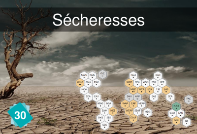

### Inspiration

Il y a quelques semaines je participais à une [Fresque du climat](https://fresqueduclimat.org/) en ligne. Naturellement sensible au enjeux environnementaux et physicien de formation, je suis la cible parfaite pour ce genre de vulgarisation. 

Le principe du jeu est simple : il faut créer une fresque à l'aide de cartes représentant certains phénomènes naturels. Par exemple, ci-dessous voici la carte des sécheresses. 

Ces cartes sont disposées les unes par rapport aux autres sous le prisme des causes et conséquences. En ajoutant progressivement de nouvelles cartes et donc de nouveaux phénomènes les participants produisent un grande fresque décrivant les différents liens de cause à éffet du déréglement climatique.  

J'ai tellement aimé que j'ai voulu créer une réplique de ce jeu pour réviser le cours sur les ondes sonores que je faisais à mes classes de secondes. 

---

### Balbutiement

Rapidement je me suis apercu que j'aurai du mal a créer une unique succession logique entre chaque carte dans le domaine des ondes sonores. J'ai donc choisi l'option d'une fresque sans lien de causalité uniforme. Certaines cartes seront reliées par association en lien avec le cours, travaux pratiques ou exercices que nous avons réalisés, d'autre seront relié par des questions etc...

J'ai donc entrepris de réaliser une carte mentale du cours sur le son en pensant pouvoir traduire facilement chaque item en carte. J'en ai obtenu cette fresque qu'il faut maitenant compléter avec des images et devinettes pour rendre la mise en place plus ludique. 

Cette fresque mérite quelques explications. L'hexagone centrale _Le son_ est là pour introduire les deux questions principales : _Que Mesure-t-on ?_ et _Qu'est ce que le son ?_. Les réponses, et donc les cartes adhacentes sont relié aux TP que nous avons fait : une mesure de la _Vitesse_ du son, de _l'intensité_ et du _niveau sonore_.

La carte _niveau sonore_ nous permet d'introduire, la période, la fréquence ainsi qu'une note de musique sinusoïdale et ainsi de relié cette partie avec une mélodie _Doremifasollasido_. Cette carte mélodie provient d'un _instrument de musique_ lui même ayant pour origine la _vibration de  molécules_ répondant à la question  _Qu'est ce que le son ?_

La carte _l'intensité_ permet simplement de revenir sur les seuils important et de mettre en évidence l'absence de periodicité de l'intensité sonore. 

La carte _vitesse_ permet d'introduire la vitesse du son dans l'air et la comparaison avec un milieu moins compressible augmentant la vitesse de propagation. Cela permet également de boucler la fresque sur la question _Comment se propage le son ?_

---

### Le jeu

---

### Retour d'expérience

---

### Téléchargement
